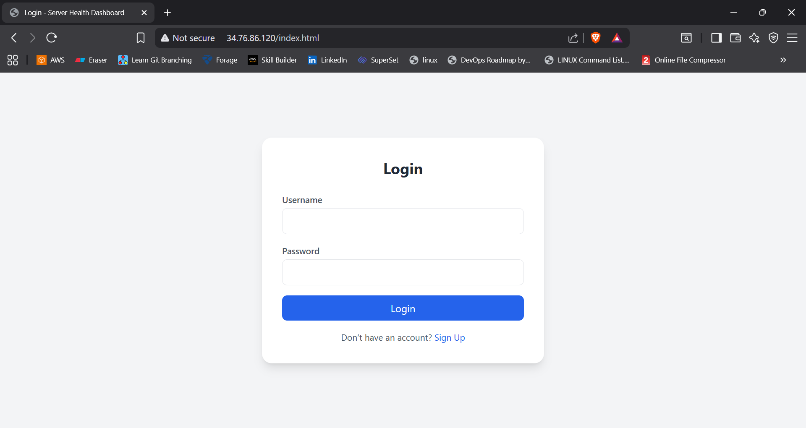
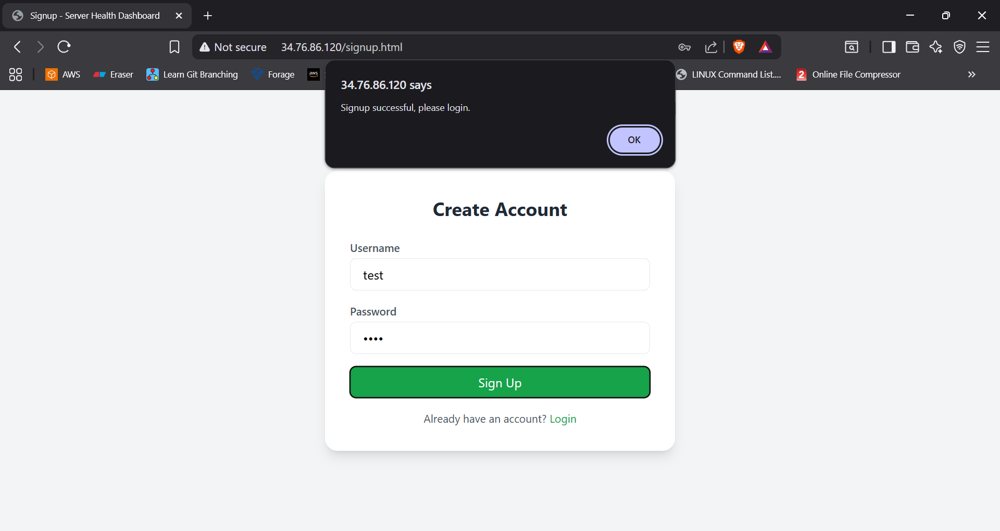
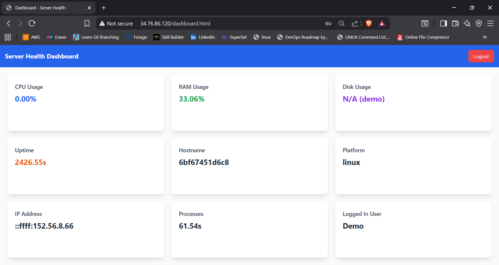
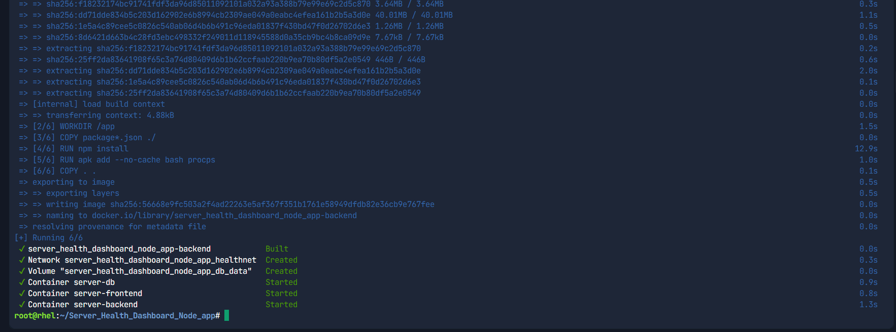
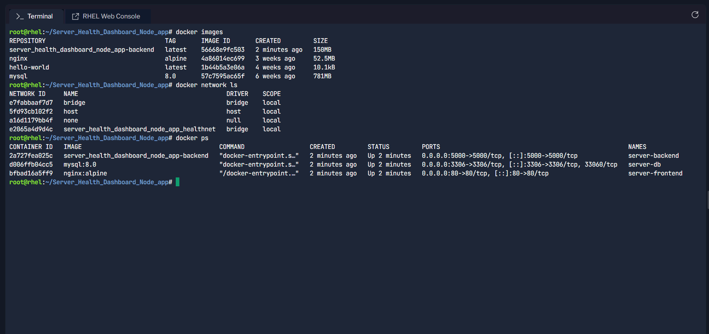
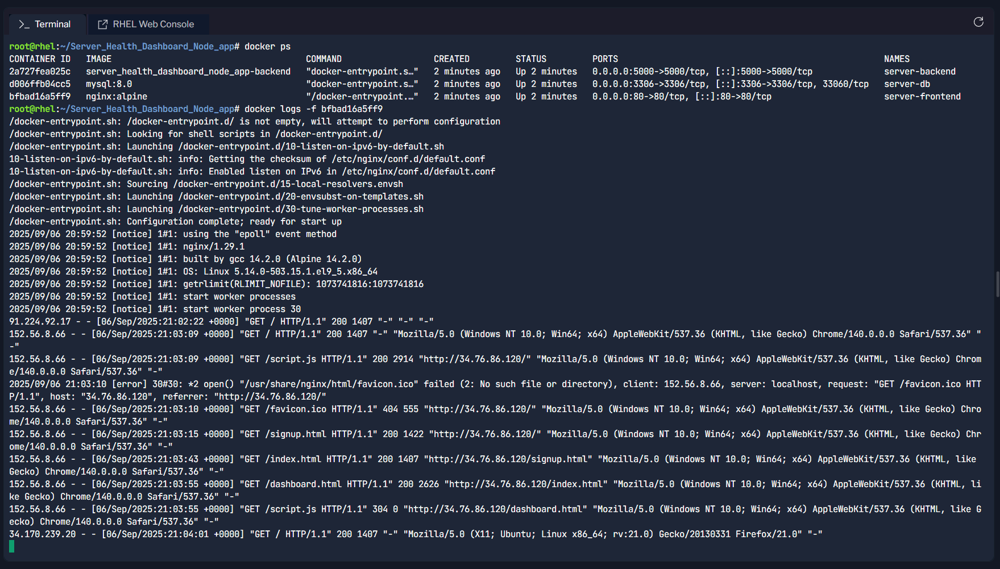
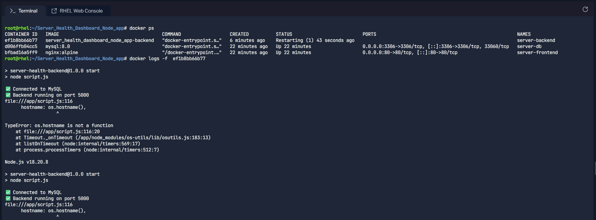
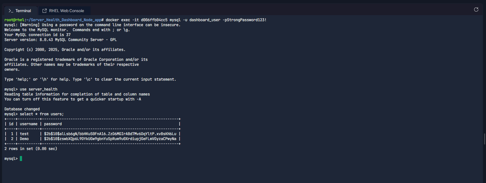

# Deployed a Three-Tier Node.js App on RHEL with Docker & Docker Compose

Hello, I'm **Pathan Ayan**, passionate about DevOps, Cloud, and Automation.  
Deployed a **three-tier Node.js application** on **RHEL Server** using **Docker & Docker Compose**. 
This project helped me learn containerization, troubleshooting, and deploying multi-tier applications on Linux servers.  
This project provides real-time server metrics (CPU, RAM, Disk, Processes, Users, etc.) along with secure login/signup functionality.  


# 📸 Preview  

### Login Page  


### SignUp Page


### Dashboard  


### Docker Build & Run



### Containers Status


### Frontend Logs  


### Backend Logs 


### Database 



---

## ⚙️ Features  
✅ User Authentication (Signup/Login/Logout)  
✅ Real-time Server Metrics:  
- CPU Usage  
- Memory (RAM) Usage  
- Disk Usage  
- Uptime  
- Hostname & IP Address  
- Number of Processes & Logged-in Users  
✅ Secure Password Hashing with MySQL  
✅ Multi-container setup (Frontend, Backend, Database)  
✅ Accessible via browser on multiple devices  

---

## 🛠️ Tech Stack  
- **Node.js + Express** → Backend & API  
- **MySQL** → Database & User Storage  
- **HTML + TailwindCSS + JS** → Frontend UI  
- **Docker & Docker Compose** → Containerization & Orchestration  
- **RHEL (Linux)** → Server Environment  
- **Firewalld** → Port Management & Security  
- **GitHub** → Version Control  

---

## 📦 Installation & Setup  

### 1️⃣ Clone the repo  
```bash
git clone https://github.com/Ayan01711/Server_Health_Dashboard_Node_app.git
cd Server_Health_Dashboard_Node_app
```

## Create .env File with  
```bash
DB_HOST=server_db
DB_USER=dashboard_user
DB_PASSWORD=yourpassword
DB_NAME=server_health
```

## Install and setup Docker 
```bash
./docker_setup.sh
```

## Open Required Ports 
``` bash
sudo firewall-cmd --zone=public --add-port=80/tcp --permanent
sudo firewall-cmd --zone=public --add-port=5000/tcp --permanent
sudo firewall-cmd --reload
sudo firewall-cmd --list-ports
```
## Build Images & Run containers 
``` bash
docker-compose up --build -d
```
## Verify Containers, Networks, Volumes, and Images
``` bash 
docker images
docker network ls
docker volume ls
docker ps
```

##  🔑 Access
```bash
- **Frontend:** http://<server-ip>
- **Backend API:** http://<server-ip>:5000/metrics/latest
- **Database:** MySQL inside Docker container
```
## Check logs and Database
- View logs: 
``` bash
docker logs <container_ID>
```
- Access Database Container
```bash
docker exec -it <container_ID> mysql -u <username> -p <password>
```

--- 

## 👨‍💻 Deployed by: **Pathan Ayan**  
📌 LinkedIn: [Pathan Ayan](https://www.linkedin.com/in/ayan01711/)  
📌 GitHub: [Ayan01711](https://github.com/Ayan01711)  
📌 Instagram: [Ayan01711](https://www.instagram.com/itz_ayan1711/)

